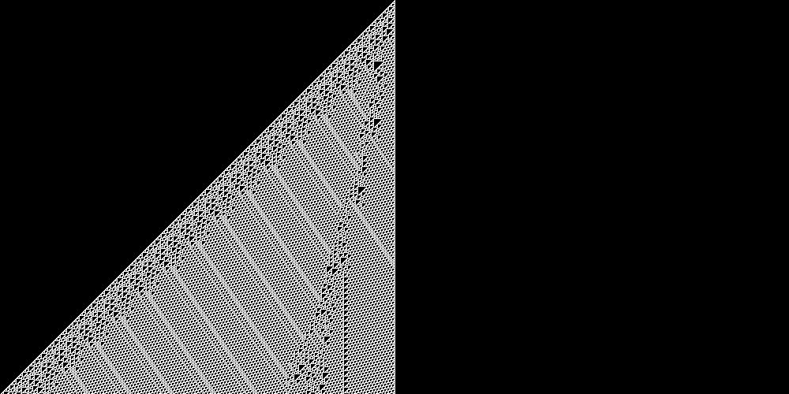

# ca-rs

One dimensional Elementary Cellular Automata (ECA) - the kind classified by Wolfram [1]. 
You can specify the rule to use as well as the initial state.

There are two versions:
* lite - minimal dependencies, constrained to a width of 64, ASCII output.
* eca - arbitrary width, PNG/ASCII output

# References

[1] Stephen Wolfram - A New Kind Of Science

# Usage 

## Bin eca

```
cargo run --bin eca -- --help
ECA to PNG Generator

Usage: eca [OPTIONS]

Options:
  -r, --rule <RULE>        [default: 30]
  -w, --width <WIDTH>      [default: 1000]
  -s, --steps <STEPS>      [default: 500]
  -o, --output <OUTPUT>    [default: output.png]
  -i, --initial <INITIAL>  Initial state as string of '0' and '1'
  -a, --ascii              Output ASCII text to stdout instead of PNG
  -h, --help               Print help
  -V, --version            Print version
```

```
cargo run --bin eca -- --rule 110

```



## Bin lite 

```
cargo run --bin lite -- --help
Elementary Cellular Automaton (ECA) Simulator

Usage: lite [OPTIONS]

Options:
  -r, --rule <RULE>    rule (0..255) [default: 30]
  -s, --state <STATE>  Input (u64) - use binary (0b), octal (0o), hex (0x) or decimal notation [default: 0x80000000]
  -S, --steps <STEPS>  number of steps (0..) [default: 32]
  -h, --help           Print help
  -V, --version        Print version
```

```
cargo run --bin lite -- --rule 90
................................O...............................
...............................O.O..............................
..............................O...O.............................
.............................O.O.O.O............................
............................O.......O...........................
...........................O.O.....O.O..........................
..........................O...O...O...O.........................
.........................O.O.O.O.O.O.O.O........................
........................O...............O.......................
.......................O.O.............O.O......................
......................O...O...........O...O.....................
.....................O.O.O.O.........O.O.O.O....................
....................O.......O.......O.......O...................
...................O.O.....O.O.....O.O.....O.O..................
..................O...O...O...O...O...O...O...O.................
.................O.O.O.O.O.O.O.O.O.O.O.O.O.O.O.O................
................O...............................O...............
...............O.O.............................O.O..............
..............O...O...........................O...O.............
.............O.O.O.O.........................O.O.O.O............
............O.......O.......................O.......O...........
...........O.O.....O.O.....................O.O.....O.O..........
..........O...O...O...O...................O...O...O...O.........
.........O.O.O.O.O.O.O.O.................O.O.O.O.O.O.O.O........
........O...............O...............O...............O.......
.......O.O.............O.O.............O.O.............O.O......
......O...O...........O...O...........O...O...........O...O.....
.....O.O.O.O.........O.O.O.O.........O.O.O.O.........O.O.O.O....
....O.......O.......O.......O.......O.......O.......O.......O...
...O.O.....O.O.....O.O.....O.O.....O.O.....O.O.....O.O.....O.O..
..O...O...O...O...O...O...O...O...O...O...O...O...O...O...O...O.
.O.O.O.O.O.O.O.O.O.O.O.O.O.O.O.O.O.O.O.O.O.O.O.O.O.O.O.O.O.O.O.O
```

